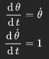
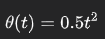

[](https://goreportcard.com/report/github.com/soypat/godesim)
[](https://pkg.go.dev/github.com/soypat/godesim)

# godesim

Simulate complex systems with a simple API.
---

Wrangle non-linear differential equations while writing maintainable, simple code.

## Installation

Requires Go.

```console
go get github.com/soypat/godesim
```

## Progress

Godesim is in early development and will naturally change as it is used more.
 The chart below shows some features that are planned or already part of godesim.

| Status legend | Planned | Started | Prototype | Mature |
| ------------- |:-------:|:-------:|:---------:|:------:|
| Legend symbol |    ✖️    |    🏗️   |     🐞️    |   ✅️   |

| Features | Status | Notes |
| -------- |:------:| ----- |
| Non-linear solver | 🐞️ | First implementation done. Needs more unit testing. |
| Non-autonomous support | 🐞️ | `U` vector which need not a defined change equation like `X` does.|
| Event driver | ✖️ | Ability to change simulation behaviour during run. i.e: step size, equations used. |
| Stiff solver | ✖️ | Only have RK4 solver for now. |


## Examples

### ODE multivariable solver with super simple API

Imports:
```go
import (
    "github.com/soypat/godesim"
    "github.com/soypat/godesim/state"
)
```

```go
// Declare your rate-of-change functions using state-space symbols
Dtheta := func(s state.State) float64 {
	return s.X("theta-dot")
}

DDtheta := func(s state.State) float64 {
    return 1
}
// Set the Simulation's differential equations and initial values and hit Begin!
sim := godesim.New() // Configurable with Simulation.SetConfig(godesim.Config{...})
sim.SetChangeMap(map[state.Symbol]state.Changer{
    "theta":  Dtheta,
    "theta-dot": DDtheta,
})
sim.SetX0FromMap(map[state.Symbol]float64{
    "theta":  0,
    "theta-dot": 0,
})
sim.SetTimespan(0.0, 1.0, 10) // One second simulated
sim.Begin()
```

The above code solves the following system:



for the domain `t=0` to `t=1.0` in 10 steps where `theta` and `theta-dot` are the `X` variables. The resulting curve is quadratic as the solution for this equation (for theta and theta-dot equal to zero) is



### How to obtain results
```go
// one can then obtain simulation results as float slices 
t := sim.Results("time")
theta := sim.Results("theta")
```